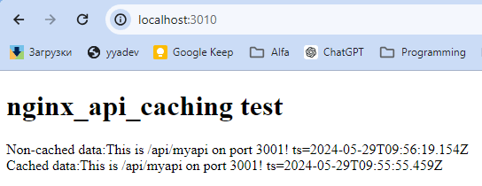

# nginx_api_caching test

How to run:

- Run 'npm i'

- Open nginx_config folder
  
  - Fix path to nginx inside run_nginx_win.bat
  
  - run_node_win.bat
  
  - run_nginx_win.bat
  
  - Browse to http://localhost:3010/

You should see something like this:

